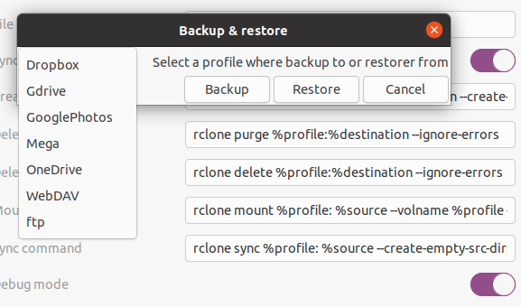

RClone Manager
==============

 

Is like Dropbox sync client but for more than 30 services, adds an indicator to the top panel so you can manage the rclone profiles configured in your system, perform operations such as mount as remote, watch for file modifications, sync with remote storage, navigate it's main folder. Also, it shows the status of each profile so you can supervise the operations, and provides an easy access log of events. Backup and restore the rclone configuration file, so you won't have to configure all your devices one by one

Extension page on Gnome Extensions [RClone Manager](https://extensions.gnome.org/extension/5006/rclone-manager)

# Features 

- Works with password protected crclone configurations
- Does not track your data like Dropbox, Google or Microsoft's clients will do, plain functionality
- Adds an indicator in the system tray to check and manage rclone configurations
- Works with rclone
- Two modes of work: **watch files**  and **mount remote**   service
- Customizable rclone commands
- Customizable list os file extensions to be ignored

- Backup and restore the rclone configuration file, so you won't have to configure all your devices one by one
    1. Configure all your remote services profiles on the first device
    2. Go to settings -> backup & restore -> select a profile -> Backup
    3. On the rest devices, Go to settings -> backup & restore -> select a profile -> Restore

- Easy access log of events 
- It has been tested on Dropbox, Gdrive, GooglePhotos, Mega, WebDAV (NextCloud), ftp and OneDrive. Other compatible cloud services may (not) work (see [rclone documentation](https://rclone.org/overview/)), hope you enjoy trying them
- Potentially compatible with those cloud services: 

|||||||
|--|--|--|--|--|--|
1Fichier| Akamai Netstorage| Alibaba Cloud (Aliyun) Object Storage System (OSS)| Amazon Drive (See note)| Amazon S3| Backblaze B2| Box| Ceph| Citrix ShareFile| 
C14| DigitalOcean Spaces| Digi Storage| Dreamhost| Dropbox| Enterprise File Fabric| 
FTP| Google Cloud Storage| Google Drive|Google Photos| HDFS| HTTP| 
Hubic| Jottacloud| IBM COS S3| Koofr| Mail.ru Cloud| Memset Memstore| 
Mega| Memory| Microsoft Azure Blob Storage| Microsoft OneDrive| Minio| Nextcloud| OVH| 
OpenDrive| OpenStack Swift| Oracle Cloud Storage| ownCloud| pCloud| premiumize.me| 
put.io| QingStor| Rackspace Cloud Files| rsync.net| Scaleway| Seafile| 
Seagate Lyve Cloud| SeaweedFS| SFTP| Sia| StackPath| Storj| 
SugarSync| Tencent Cloud Object Storage (COS)| Uptobox| Wasabi| WebDAV| Yandex Disk| 
Zoho WorkDrive| The local filesystem 

####  Features of watch mode 

- Synchronizes file downstream from cloud on start (see rclone sync documentation)
- Does monitor local files and keeps them in sync with cloud storage
- Files are stored locally, you will be able to access them offline (offline changes will be lost on manual sync)
- System tray icon show the sync status for easy check, system notifications show eventual errors
- One click sync repository
- No loops or CPU consumption when idle
- **NEW!** Does monitor cloud services for changes, and will update local files with remote modifications "live"

####  Features of mount mode

- Updates files with remote modifications, no sync needed
- Will not consume local disk space

# Limitations

####  Limitations of watch Mode

- local offline changes will be lost on manual sync, always check your changes have synched successfully
- May not delete local files on manually sync if files were deleted in the cloud

####  Limitations of mount model

- Files are not stored locally, internet connection needed
- It is slow to work with files in this mode

# **_DISCLAIMER_**

- **Files backup is strongly advised**
- **Absolutely no warranty**

# Known errors

 - Failed to create file system for "Mega:": didn't find backend called "mega"
    - Your version of rclone doesn't support this backend, update rclone

# ChangeLog

## v46.0

- [x] Shell 46 version update

## v45.1

- [x] Remove obsolete calls

## v45.0

- [x] Shell 45 version update
https://gjs.guide/extensions/upgrading/gnome-shell-45.html#extension-js

## v44.0

- [x] Shell 44 version update

## v43.1

- [x] Bug fix, matching Filenames not ignored 
- [x] Bug fix, settings translation
- [x] add Clicable notifications
- [x] add [encripted config support](https://github.com/germanztz/gnome-shell-extension-rclone-manager/issues/11)

## v43.0

- [x] Shell 43 version update
- [x] bug fixes
- [x] Add pt_BR language **Thanks @hildogjr !!**

## v42.2

- [x] bug fixes
  - [x] https://github.com/germanztz/gnome-shell-extension-rclone-manager/issues/18

## v42.1

- [x] Revision fixes
- [x] Unify versions v1 and v42

## v42.0

- [x] Shell 42 version update
- [x] add function check: Checks the files in the source and destination match.

## v1.2

- [x] Vagrant test environment
- [x] Revision fixes

## v1.1

- [x] Add function backup config
- [x] Add function restore config
- [x] Some bug fixes
- [x] Dutch translation **Thanks @Vistaus !!**
- [x] French translation **Thanks @noirbizarre !!**

## v1.0

- [x] Fix create basedir if not exist on mount
- [x] Fix show actual status when mount fails
- [x] Add notification dialog with details
- [x] Fix open action
- [x] Add reset button in setting
- [x] Fix config persistence
- [x] Add about button in setting
- [x] Fix menu update after add config
- [x] Fix permanent busy on mount
- [x] Add log to file
- [x] Translate spanish

## TODO list
- [ ] Fix Backup / restore dialog style
- [ ] add function cleanup: Clean up the remote if possible.
- [ ] add function size: Prints the total size and number of objects in remote:path.

